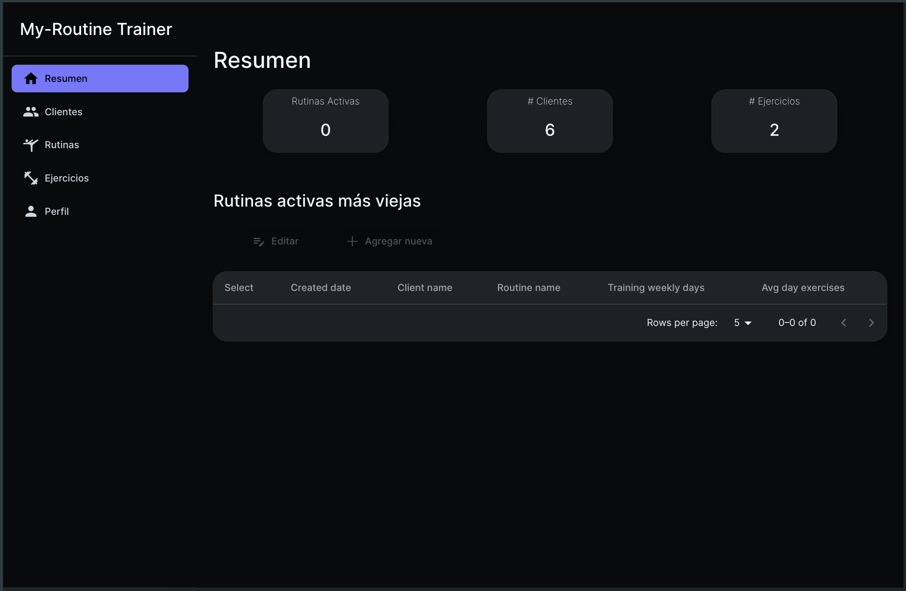

# My Routine Trainer

My Routine Trainer is a full-stack coaching platform that helps trainers design, personalize, and monitor workout plans for their clients. It blends structured data management with AI-generated media so coaches can deliver engaging content without leaving the dashboard.

## Features

- Manage clients end-to-end, from onboarding to maintaining individualized training schedules.
- Build and edit rich workout routines that combine exercises, guidance, and media assets in one view.
- Generate supporting visuals with OpenAI DALL·E 3 and stitch highlight videos with RunwayML to keep clients motivated.
- Secure the experience with Firebase Authentication, server-validated routes, and environment-aware API calls.
- Deliver responsive dashboards built with Devias React components so coaches get insight at a glance.

## Tech Stack

**Application**

- Next.js (App Router) with TypeScript for the web experience.
- Material UI and Devias Kit React components for design system consistency.
- React Loader Spinner for non-blocking data fetch feedback.

**Data & Services**

- Prisma ORM on top of PostgreSQL for relational data modeling.
- AWS S3 for storing workout media and generated assets.
- Firebase Authentication for user identity and session management.

**AI & Media Automation**

- OpenAI DALL·E 3 for generating custom artwork that complements routines.
- RunwayML for producing short-form AI videos used in promotional material.

**DevOps & Delivery**

- Vercel for zero-config deployments, edge caching, and previews.
- Environment-configurable API layer via `MY_API_URL` backed by a Node.js service.

## Demo

Click the image below to watch a short AI-assisted demo:

## Screenshots

